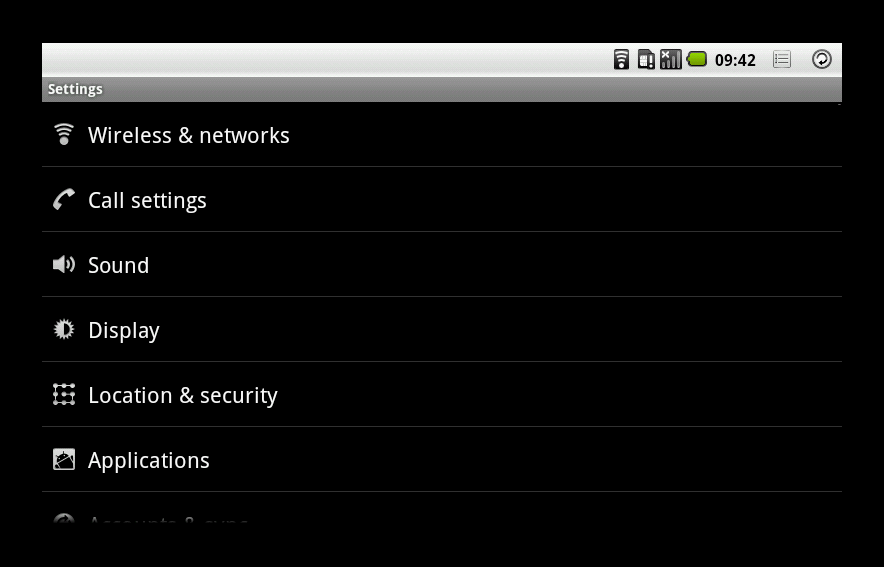
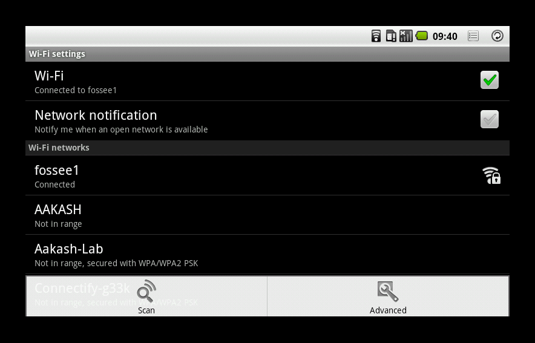
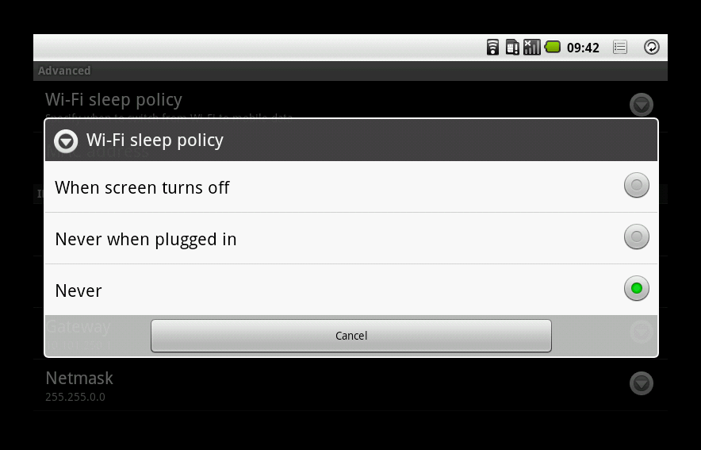
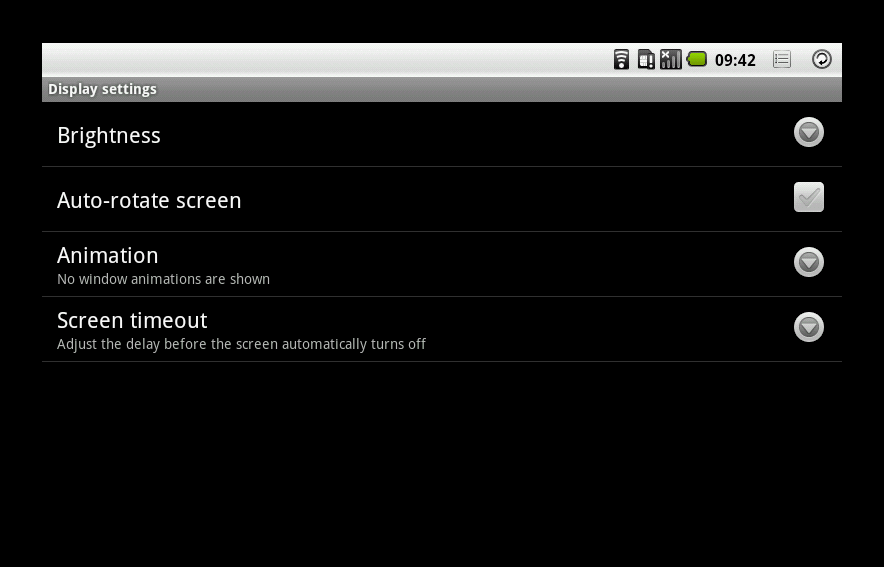
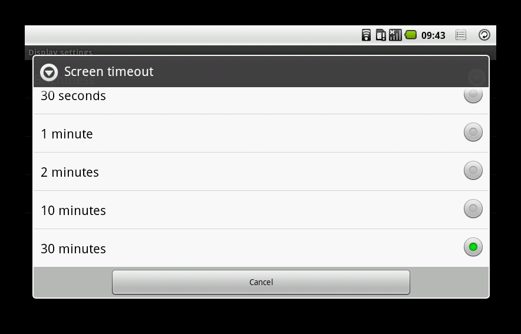
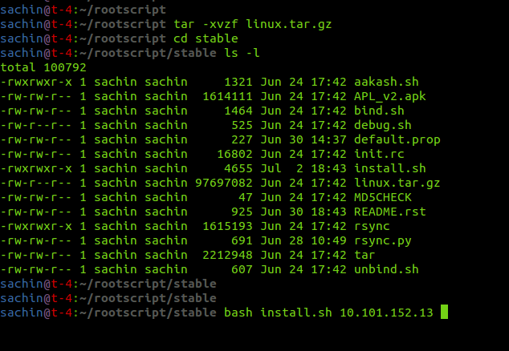

====
Installing Aakash Programming Lab
====

Prerequisite
====

* This installtion procedure only works on `GNU/Linux` based systems
* Make sure your device is connected to Wi-Fi network
* Note down the device's IP-address
* The best case would be to give a static IP-address to the device
* Select the Wi-Fi sleep policy to *Never*
* Screen timeout to **30 minutes**

Select the Wi-Fi sleep policy to *Never*:
====

Goto **Wireless & networks**, 

from the option menu(next to ``back`` button in the status bar), select **Advanced**

select **Wi-Fi sleep policy** from the menu, and press **Never**

Screen timeout to **30 minutes**
====

Goto **Display**, 

in the *Display Settings* menu, select **Screen timeout**

and press option **30 minutes**

Extraction the tarball and installation using ubuntu linux 
====

 
* Open the terminal and visit the directory where you have saved the
  tarball file and type the command below to extract the content

::
   
   tar -xvzf linux.tar.gz

this will extract the directory called ``stable``

* now change the directory to ``stable``

::

   cd stable 

* make sure atleast following file are present in the directory (using
  ``ls -l`` command)

  - ``install.sh``
  - ``default.prop``
  - ``aakash.sh``
  - ``init.rc``
  - ``linux.tar.gz``
  - ``tar``
  - ``MD5CHECK``
  - ``APL_v2.apk`` 

* and type the following command,

::
   
   bash install.sh <IP-address-of-aakash>

for example

::

   bash install.sh 10.101.152.13

* This command will begin installation of **Aakash Programming Lab**,
  please follow the instruction which appear on the terminal
