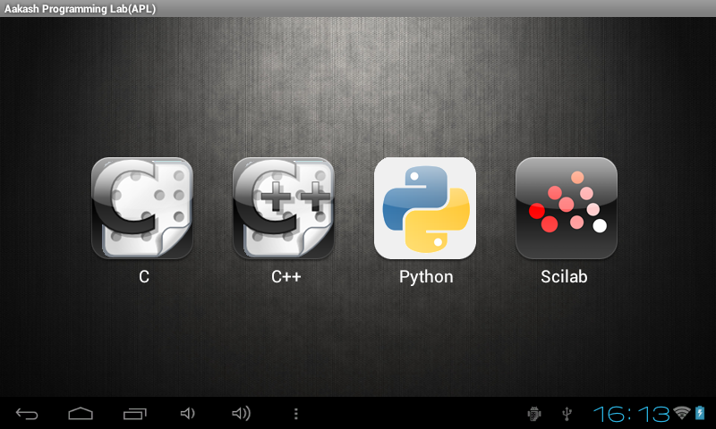

=======================================
Setting the application on the Android
=======================================

Introduction
============
Devolping an application on **Aakash**, the basic software platform
utilised was Eclipse (Indigo).  The Android Version 2.2 was the
supporting version to devlop and implement an application on
AAKASH. The objective to port the programming languages C, C++,Python
and Scilab needed an interface on android, thus Android application
package file (APK) was devloped on Eclipse and was tested rigorously
to achieve the perfect version.

Setting up the Android Envionment
================================

+ **Android SDK**
	
	* Download the android SDK from the official website
          `developer.android.com <http://developer.android.com/sdk/index.html>`_

+ **Software platform- Eclipse(Indigo)**
	
	* The basic software platform to devlop an application for
	that need to install Eclipse.
	
	* The official website to `eclipse <http://www.eclipse.org/downloads/>`_.
	The basic command for ubuntu users to check their configured
	version is `uname -a`. Type the command on the terminal and
	check for the system is 64 or 32 bit.
	
	* The linux users should install the proper version, as their
        is availabilty of two versions 64 and 32 bit.

+ **Installing the Packages in SDK Manager**
	
	* Configure the SDK manager and download tools and packages
          for different Android versions.
	
	* For example the Android 2.2 (froyo), Android 2.3
          (ginerbread), Android 3.0 or 3.1 (honeycomb), Android 4.0
          (ice cream sandwich)

+ **Adding and Configuring the ADT plugin**
	
	* Android offers a custom plugin for the Eclipse IDE, called
          Android Development Tools (ADT). This plugin is designed to
          give you a powerful, integrated environment in which to
          develop Android apps. It extends the capabilites of Eclipse
          to let you quickly set up new Android projects, build an app
          UI, debug your app, and export signed (or unsigned) app
          packages (APKs) for distribution.
	
	
+ **Setups for configuring** :
			
 `NOTE` : before starting the ADT plugin process (if installing from
  the internet), apply net settings in the Eclipse, select Windows >
  Preferences . On General option , click on Network and configure the
  internet settings.

  * Start Eclipse, then select Help > Install New Software....
			
  * Click Add, in the top-right corner.
			
  * In the Add Repository dialog that appears, enter "ADT Plugin" for
    the Name and the following URL for the location
    `https://dl-ssl.google.com/android/eclipse/ <https://dl-ssl.google.com/android/eclipse/>`_
			
  * Click OK. `Note`, If you have trouble acquiring the plugin, try
    using ``http`` in the Location URL, instead of ``https`` (``https`` is
    preferred for security reasons).
			
  * In the Available Software dialog, select the checkbox next to
    Developer Tools and click Next.
			
  * In the next window, you'll see a list of the tools to be
    downloaded. Click Next.
			
  * Read and accept the license agreements, then click Finish.
			
  * When the installation completes, restart Eclipse.

+ **Configure the ADT Plugin**
  
  * After you've installed ADT and restarted Eclipse, you must specify
    the location of your Android SDK directory.

  * Select Window > Preferences... to open the Preferences panel (on Mac
    OS X, select Eclipse > Preferences).

  * Select Android from the left panel.

  * For the SDK Location in the main panel, click Browse... and locate
    your downloaded Android SDK directory (such as android-sdk-windows).

  * Click Apply, then OK.

+ **Create new AVD**
	
  * Create a new avd in AVD manager and mention proper memory size of
    the SDcard and launch the emulator.

+ **Create your new project**
	
  * The android environment is set , create new projects and enjoy the
    android versions.

Developing the APK for the Porting of the Programming Languages
===============================================================

  * The project was entiltled as `Aakash Programming Lab (APL)`

  * The package name : **com.aakash.lab**

  * In the android project mainly the editing part was in
    layout,Activity(java class) and in AndroidManifest.xml

+ **Designing the Layout for the application**

  * The layout of the android APK consists of three xml files namely as
    `main.xml, main1.xml, and main2.`

  * `main.xml` contains the features for the first screen that displays
    the four main icons of the programming languages **C, C++, Python and
    Scilab**, besides the main heading **Aakash Programming Lab (APL)**.

  * The icons were padded properly to fit according to tablet screen
    size and resolution

  * The icons were polished and scaled for glossy display of the
    application on the tablet screen.

::

    <TableRow
        android:id="@+id/tableRow1"
        android:layout_width="wrap_content"
        android:layout_height="wrap_content" >

    <ImageButton
        android:id="@+id/imageButton1"
        android:layout_width="wrap_content"
        android:layout_height="wrap_content"
        android:background="@drawable/c_back" 
        android:padding="54dip"/>

    <ImageButton
        android:id="@+id/imageButton2"
        android:layout_width="wrap_content"
        android:layout_height="wrap_content"
        android:background="@drawable/cpp_back" 
        android:padding="54dip"/>
    
    <ImageButton
        android:id="@+id/imageButton3"
        android:layout_width="wrap_content"
        android:layout_height="wrap_content"
        android:background="@drawable/python_back" 
        android:padding="54dip"/>
    
    <ImageButton
        android:id="@+id/imageButton4"
        android:layout_width="wrap_content"
        android:layout_height="wrap_content"
        android:background="@drawable/scilab"
        android:padding="54dip"/>
    </TableRow>

 

+

  * In order to display the web page of the each programming language
    main1.xml was created.

  * The webview feature was added in the xml file, which will be
    utilised by the each webpage of programming language to display the
    its key features and functionality.

::

     <WebView android:id="@+id/webView1"
              android:layout_width="fill_parent"
              android:layout_height="fill_parent" />

		
.. image:: images/text_console.png
   :name: text editor and console output page
   :align: center

+
				
  * In order to display the web page for Help and About main2.xml was
    created.
		
  * The webview feature and Button was added in the xml file, the
    webview for webpage of help and options , and a close button to take
    back the user back to the previous state.

::
		
        <Button
            android:id="@+id/button1"
            android:layout_width="match_parent"
            android:layout_height="wrap_content"
            android:text="Close" />

        WebView
            android:id="@+id/webView1"
            android:layout_width="match_parent"
            android:layout_height="match_parent"/>

+ **The APL activity**
        
  * The main activity was entiltled as APL Activity.
  * The activity contains the essential and required import like

::

            import com.aakash.lab.R;
            import android.app.Activity;
            import android.app.AlertDialog;
            import android.content.DialogInterface;
            import android.content.Intent;
            import android.os.Bundle;
            import android.view.View;
            import android.view.View.OnClickListener;
            import android.widget.ImageButton;
            import android.widget.TextView;    
		

The activity intializes all the essential parameters and variables.
		  
::

     ImageButton rd1, rd2, rd4, rd5; 
     TextView tv1,tv2; 
     @Override 
     public void onCreate(Bundle savedInstanceState) {
     super.onCreate(savedInstanceState);
     setContentView(R.layout.main); 
    
     // parameters initialisation for image buttons  
     rd1 = (ImageButton)findViewById(R.id.imageButton1);
     rd2 = (ImageButton)findViewById(R.id.imageButton2);	
     rd3 = (ImageButton)findViewById(R.id.imageButton3);
     rd4 = (ImageButton)findViewById(R.id.imageButton4); 
     tv1 = (TextView)findViewById(R.id.textView1);
     tv2 = (TextView)findViewById(R.id.textView2); 
     rd1.setOnClickListener(this);
     rd2.setOnClickListener(this);	
     rd3.setOnClickListener(this);
     rd5.setOnClickListener(this);	
     }

		
Synchronises the four subclasses created mainly for C, C++, Python and
Scilab.
		
::

    public void onClick(View v) {
    // TODO Auto-generated method stub
    switch (v.getId()) { 

    case R.id.imageButton1:	
    Intent myIntent = new Intent(v.getContext(),
    c.class);
    startActivityForResult(myIntent, 0);
    break; 
	
    case R.id.imageButton2:		
    Intent myIntent1 = new Intent(v.getContext(),
    cp.class);
    startActivityForResult(myIntent1, 0);
    break; 			  
    case R.id.imageButton3:   
    Intent myIntent2 = new Intent(v.getContext(),
    py.class);
    startActivityForResult(myIntent2, 0);	
    break;

    case R.id.imageButton4:			
    ntent myIntent3 = new Intent(v.getContext(),
    sci.class);
    startActivityForResult(myIntent3, 0);
    break;	 
    default:
    break;
    }
    }

Contains the code for user to quit and switch to another programming
language.

::

   public void onBackPressed() {

		AlertDialog.Builder builder = new AlertDialog.Builder(this);
		builder.setMessage("Are you sure you want to exit?")
				.setCancelable(false)
				.setPositiveButton("Yes",
						new DialogInterface.OnClickListener() {
							public void onClick(DialogInterface dialog, int id) {
								finish();
								android.os.Process
										.killProcess(android.os.Process.myPid());
							}
						})
				.setNegativeButton("No", new DialogInterface.OnClickListener() {
					public void onClick(DialogInterface dialog, int id) {
						dialog.cancel();
					}
				});
		AlertDialog alert = builder.create();
		alert.show();
	}

		
+ **The Sub Classes**		
	
  * `c.java`
		
   - The sub class for programming language C.

   - The subclass contains the essential and required import like
            
::

        import android.app.ActivityGroup;
        import android.app.AlertDialog;
	import android.os.Bundle;
	import android.os.Environment;
	import android.util.Log;
	import android.view.Menu;
	import android.view.MenuInflater;
	import android.view.MenuItem;
	import android.webkit.WebChromeClient;
	import android.webkit.WebSettings;
	import android.webkit.WebView;
	import com.aakash.lab.R;
	import android.webkit.JsResult;
		
	import android.app.AlertDialog.Builder;
	import android.app.Dialog;
	import android.content.DialogInterface;
	import java.io.*;

- Webview feature implementation- the java script is enabled,
 
- the scrollbars are disabled to avoid the screen shift,

- the cache problem is resolved,

- the pop ups in the webview are enabled to take the arguments.

::

	        // web view for c class
		WebView engine = (WebView) findViewById(R.id.webView1);
		WebSettings webSettings = engine.getSettings();
		// java script enabled
		webSettings.setJavaScriptEnabled(true);
		// js interface for reload
		engine.addJavascriptInterface(new JsInterface(), "android");
		// cache problem removed
		webSettings.setCacheMode(WebSettings.LOAD_NO_CACHE);
		webSettings.setAppCacheEnabled(false);
		// scroll bars disabled
		engine.setVerticalScrollBarEnabled(false);
		engine.setHorizontalScrollBarEnabled(false);
		// focused the web page
		engine.setOnTouchListener(new View.OnTouchListener() {
			public boolean onTouch(View v, MotionEvent event) {
				switch (event.getAction()) {
				case MotionEvent.ACTION_DOWN:
				case MotionEvent.ACTION_UP:
					if (!v.hasFocus()) {
						v.requestFocus();
					}
					break;
				}
				return false;
			}

			public boolean onTouch1(View arg0, MotionEvent arg1) {
				// TODO Auto-generated method stub
				return false;
			}
		});

		engine.loadUrl("http://127.0.0.1/html/c/index.html");

		engine.setWebChromeClient(new WebChromeClient()

		{
			@Override
			public void onConsoleMessage(String message, int lineNumber,
					String sourceID) {
				Log.d("MyApplication", message + " -- From line " + lineNumber
						+ " of " + sourceID);
				super.onConsoleMessage(message, lineNumber, sourceID);
			}

		});
	
				
- Menu implementation for options like `Save`, `Open` and `Example`,
  `Help` and `About`.

::

     public boolean onCreateOptionsMenu(Menu menu) {
		MenuInflater inflater = getMenuInflater();
		inflater.inflate(R.menu.menu1, menu);
		return true;
	}

	public boolean onOptionsItemSelected(MenuItem item) {
		// Handle item selection

		switch (item.getItemId()) {
		case R.id.savecode1:
			save();
			return true;
		case R.id.open:
			oe_path = Environment.getExternalStorageDirectory() + "/APL/c/code/";
			mPath = new File(oe_path);
			loadFileList();
			return true;
		case R.id.example:
			oe_path = "/data/local/linux/var/www/html/c/example/";
			mPath = new File(oe_path);
			loadFileList();
			return true;
		case R.id.help:
			Intent myIntent = new Intent(c.this, help.class);
			startActivityForResult(myIntent, 0);
			return true;
		case R.id.about:
			Intent myIntent1 = new Intent(c.this, about.class);
			startActivityForResult(myIntent1, 0);
			return true;
		default:
			return super.onOptionsItemSelected(item);
		}
	}

			
- Save feature to save the code in sdcard.
			
::

    public void save()
    {
    	  // TODO Auto-generated method stub
	    	 WebView engine = (WebView) findViewById(R.id.webView1); 
	    	 WebSettings webSettings = engine.getSettings();
	         webSettings.setJavaScriptEnabled(true);
	         engine.getSettings().setJavaScriptEnabled(true);
	         webSettings.setCacheMode(WebSettings.LOAD_NO_CACHE);
	  	 webSettings.setAppCacheEnabled(false);
	         engine.setWebChromeClient(new MyWebChromeClientsci());
	         engine.loadUrl("javascript:savecode()");      	
    }

			
- Open feature to display the list of files saved in sdcard and
  display the file in codemirror of the webpage using javascript.
			
::

    private void loadFileList() {
		try {
			mPath.mkdirs();
		} catch (SecurityException e) {
			System.out.println("unable to write on the sd card ");
		}
		if (mPath.exists()) {
			FilenameFilter filter = new FilenameFilter() {
				public boolean accept(File dir, String filename) {
					File sel = new File(dir, filename);
					return filename.contains(FTYPE) || sel.isDirectory();
				}
			};
			mFileList = mPath.list(filter);

			onCreateDialog(DIALOG_LOAD_FILE);

		} else {
			mFileList = new String[0];
		}
	}

	protected Dialog onCreateDialog(int id) {

		Dialog dialog = null;
		AlertDialog.Builder builder = new Builder(this);

		switch (id) {
		case DIALOG_LOAD_FILE:

			builder.setTitle("Choose your file");
			if (mFileList == null) {
				System.out.println("Showing file picker before loading the file list ");
				dialog = builder.create();
				return dialog;
			}
			builder.setItems(mFileList, new DialogInterface.OnClickListener() {
				public void onClick(DialogInterface dialog, int which) {
					mChosenFile = mFileList[which];

					InputStream inStream = null;
					OutputStream outStream = null;

					try {
						File bfile = new File(
								"/data/local/linux/var/www/html/scilab/code/.open_file.cde");

						inStream = new FileInputStream(oe_path + mChosenFile);
						outStream = new FileOutputStream(bfile);
						byte[] buffer = new byte[1024];
						int length;
						while ((length = inStream.read(buffer)) > 0) {
							outStream.write(buffer, 0, length);
						}

						inStream.close();
						outStream.close();
						openFile();
					} catch (IOException e) {
						e.printStackTrace();
					}
				}
			});
			break;
		}
		dialog = builder.show();
		return dialog;
	}
			

- Examples for the demo part was also added in the simlar fashion as
  open was implemented .
			
- For implementing the Help and Options , two new sub classes were
  created namely **help.class** and **options.class** which are
  explained in detail after sci.class.
			
- Similar process was repeated in **cpp.java** for C++ and in
  **py.java** for Python creating the web view, implementing the menu
  and additional features like Open, Save, Example, Help and About to
  increase the functionality of the programming language so ported on
  the tablet.

* `sci.java`
		
  - In Scilab along with the output, the garpical output (plot) is also
    displayed , so additional feature like Save Figure was implemented.

::
			
    public void savefig() {
	// TODO Auto-generated method stub
	WebView engine = (WebView) findViewById(R.id.webView1);
	WebSettings webSettings = engine.getSettings();
	webSettings.setJavaScriptEnabled(true);
	engine.getSettings().setJavaScriptEnabled(true);
	webSettings.setCacheMode(WebSettings.LOAD_NO_CACHE);
	webSettings.setAppCacheEnabled(false);
	engine.setWebChromeClient(new MyWebChromeClientsci());
	engine.loadUrl("javascript:saveImg()");
    }

			
* `help.java`
		
   - Help is implemented to provide the guidance to the user.  To
     enrich this feature a new sub class is created and whenevr the user
     opts for Help in menu, it directs him to the new webview that
     displays the contents of help.html.
			
::

    CODE
    //button for close
    Button btnOpenNewActivity = (Button) findViewById(R.id.button1);
    btnOpenNewActivity .setOnClickListener(new View.OnClickListener() {
    	// close this class and bring to same state
        public void onClick(View v) {        	
            finish();
        }
    }); 	        
    // webview for help     
    WebView engine = (WebView) findViewById(R.id.webView1);       
    WebSettings webSettings = engine.getSettings();
    //java script enabled
    webSettings.setJavaScriptEnabled(true);
    // cache problem removed
    webSettings.setCacheMode(WebSettings.LOAD_NO_CACHE);
    webSettings.setAppCacheEnabled(false);
     //scroll bars disabled in webview
    engine.setVerticalScrollBarEnabled(false);
    engine.setHorizontalScrollBarEnabled(false);
     // focus on web page
    engine.setOnTouchListener(new View.OnTouchListener() { 	        
	public boolean onTouch(View v, MotionEvent event) {
	           switch (event.getAction()) { 
	               case MotionEvent.ACTION_DOWN: 
	               case MotionEvent.ACTION_UP: 
	                   if (!v.hasFocus()) { 
	                       v.requestFocus(); 
	                   } 
	                   break;      	           } 
	           return false; 
	        }
    public boolean onTouch1(View arg0, MotionEvent arg1) {
		// TODO Auto-generated method stub
		return false;
	}
	});	       
    // address of html file in ch root
    engine.loadUrl("http://127.0.0.1/html/help.html"); 
    // enabling all pop ups in web view
    engine.setWebChromeClient(new WebChromeClient()
    {
      @Override
      public void onConsoleMessage(String message, int lineNumber,String sourceID) {
          Log.d("MyApplication", message + " -- From line "+ lineNumber + " of " + sourceID);
          super.onConsoleMessage(message, lineNumber, sourceID);
      }
    });		        }    

			
* `options.java`
		
  - To make the user compatible with different layout, icons and their
    functionality, the options was added in the menu.
			
  - Whenever the user opts for the options in menu, the class directs
    the user to new screen displaying the required important content.
	
::

    CODE NOT FOUND
    //button for close
    Button btnOpenNewActivity = (Button) findViewById(R.id.button1);
    btnOpenNewActivity .setOnClickListener(new View.OnClickListener() {
    	// close this class and bring to same state
        public void onClick(View v) {           	
            finish();		        }
    });         
    // webview for help     
    WebView engine = (WebView) findViewById(R.id.webView1);       
    WebSettings webSettings = engine.getSettings();
    //java script enabled
    webSettings.setJavaScriptEnabled(true);
    // cache problem removed
    webSettings.setCacheMode(WebSettings.LOAD_NO_CACHE);
     webSettings.setAppCacheEnabled(false);
     //scroll bars disabled in webview
    engine.setVerticalScrollBarEnabled(false);
	 engine.setHorizontalScrollBarEnabled(false);
     // focus on web page
    engine.setOnTouchListener(new View.OnTouchListener() { 	        
	public boolean onTouch(View v, MotionEvent event) {
	           switch (event.getAction()) { 
	               case MotionEvent.ACTION_DOWN: 
	               case MotionEvent.ACTION_UP: 
	                   if (!v.hasFocus()) { 
	                       v.requestFocus(); 
	                   } 
	                   break;       	           } 
	           return false; 
	        }

    public boolean onTouch1(View arg0, MotionEvent arg1) {
    		// TODO Auto-generated method stub
    		return false;
    	}
    	});	       
    // address of html file in ch root
    engine.loadUrl("http://127.0.0.1/html/help.html"); 
    // enabling all pop ups in web view
    engine.setWebChromeClient(new WebChromeClient()
    {          @Override
      public void onConsoleMessage(String message, int lineNumber,String sourceID) {
          Log.d("MyApplication", message + " -- From line "+ lineNumber + " of " + sourceID);
          super.onConsoleMessage(message, lineNumber, sourceID);
      }
    });		        }    

			
The Android ``Manifest.xml``
========================
	
* The most important part for a project to execute, lies in its
  manifest.xml file.

* The manifest contains the permission for the webview enability, for
  the webview feature.

* The permission to read and write from the External Source, handling
  the sdcard.

::

    <uses-sdk android:minSdkVersion="8" />
    <uses-permission android:name="android.permission.INTERNET" />
    <uses-permission android:name="android.permission.WRITE_EXTERNAL_STORAGE" />

		
* The application intilaization and icon and its label information.
		  
::

     <application
        android:icon="@drawable/apl"
        android:label="@string/app_name9" 
        android:background="@null"
        >
		

* The main activity APL and its sub classes intilaization,name, label
  and name information.
		
::

          <activity
            android:name=".APLActivity"
            android:configChanges="keyboardHidden|orientation"
            android:label="@string/app_name" >
            <intent-filter>
                <action android:name="android.intent.action.MAIN" />
                <category android:name="android.intent.category.LAUNCHER" />
            </intent-filter>
          </activity>
          <activity
            android:name="com.aakash.lab.sci"
            android:label="@string/app_name1" >
          </activity>
          <activity
            android:name="com.aakash.lab.c"
            android:label="@string/app_name2" >
          </activity>
          <activity
            android:name="com.aakash.lab.cp"
            android:label="@string/app_name3" >
          </activity>
          <activity
            android:name="com.aakash.lab.py"
            android:label="@string/app_name4" >
          </activity>        
          <activity
            android:name=".OnlyExt"
            android:label="@string/app_name4" >
          </activity>
          <activity
            android:name=".chelp"
            android:label="@string/app_name7" >
          </activity>
          <activity
            android:name=".cphelp"
            android:label="@string/app_name7" >
          </activity>
          <activity
            android:name=".pyhelp"
            android:label="@string/app_name7" >
          </activity>
          <activity
            android:name=".scihelp"
            android:label="@string/app_name7" >
          </activity>
          <activity
            android:name="com.aakash.lab.about"
            android:label="@string/app_name8" >
          </activity>

========================================
Shell in a box version
========================================

Need of another version
=======================

* The previous version so implemented was incapable to take input from
  the user hence a robust version need to develop to make the
  application more interactive with user, giving the user a chance to
  code and enhance further the concepts and deepen its roots in the
  programming language.
	
* Developing the APK for the next version for the Porting of the Programming Languages

  - The  project was entiltled as **Aakash Programming Lab (APL)**
  - The package name : **com.aakash.lab**

* Designing the Layout for the application

* The layout of the android APK consists of four xml files namely as
  `main.xml, main1.xml, main2.xml, main3.xml`.
	
Xml files
=========

* `main.xml` contains the features for the first screen that displays
  the four main icons of the programming languages **C, C++, Python**
  and Scilab, besides the main heading **Aakash Programming Lab (APL)**.

* In order to display the web page of the each programming language
  `main1.xml` was created.

* The webview feature was added in the xml file, which will be
  utilised by the each webpage of programming language to display the
  its key features and functionality.
	
::

   <WebView android:id="@+id/webView1"
       android:layout_width="fill_parent"
       android:layout_height="fill_parent"
       />

.. image:: /img.jpg
   :name: screenshot of second screen

* To display the graphical output of the scilab on a two column web
  page format, we need an image view and close button thus the layout
  was sketched at  `main3.xml`.

::

   <Button
        android:id="@+id/button1"
        android:layout_width="match_parent"
        android:layout_height="wrap_content"
        android:text="Close" />

   <ImageView
        android:id="@+id/imageView1"
        android:layout_width="fill_parent"
        android:layout_height="fill_parent"/>

* In order to display the web page for Help and About `main3.xml` was
  created. The webview feature and Button was added in the xml file, the
  webview for webpage of help and options , and a close button to take
  back the user back to the previous state.

::

    <Button
        android:id="@+id/button1"
        android:layout_width="match_parent"
        android:layout_height="wrap_content"
        android:text="Close" />

    <WebView
        android:id="@+id/webView1"
        android:layout_width="match_parent"
        android:layout_height="match_parent" />

* **The APL activity**

  * The main activity was entiltled as APL Activity.
  * The activity contains the essential and required import like,

::

    import com.aakash.lab.R;
    import android.app.Activity;
    import android.app.AlertDialog;
    import android.content.DialogInterface;
    import android.content.Intent;
    import android.os.Bundle;
    import android.view.View;
    import android.view.View.OnClickListener;
    import android.widget.ImageButton;
    import android.widget.TextView;

The activity intializes all the essential parameters and variables.

::

   ImageButton rd1, rd2, rd4, rd5; 
	TextView tv1,tv2; 
	@Override 
	public void onCreate(Bundle savedInstanceState) {
	super.onCreate(savedInstanceState);
	setContentView(R.layout.main); 
	// parameters initialisation for image buttons  
	rd1 = (ImageButton)findViewById(R.id.imageButton1);
	rd2 = (ImageButton)findViewById(R.id.imageButton2);	
	rd3 = (ImageButton)findViewById(R.id.imageButton3);
	rd4 = (ImageButton)findViewById(R.id.imageButton4); 
	tv1 = (TextView)findViewById(R.id.textView1);
	tv2 = (TextView)findViewById(R.id.textView2); 
	rd1.setOnClickListener(this);
	rd2.setOnClickListener(this);	
	rd3.setOnClickListener(this);
	rd5.setOnClickListener(this); 	
	}

Synchronises the four subclasses created mainly for C, C++, Python and
Scilab.

::

    	public void onClick(View v) {
		// TODO Auto-generated method stub
		switch (v.getId()) {
		case R.id.imageButton1:

			Intent myIntent = new Intent(v.getContext(), c.class);
			startActivityForResult(myIntent, 0);
			break;
		case R.id.imageButton2:

			Intent myIntent1 = new Intent(v.getContext(), cp.class);
			startActivityForResult(myIntent1, 0);
			break;

		case R.id.imageButton3:

			Intent myIntent3 = new Intent(v.getContext(), py.class);
			startActivityForResult(myIntent3, 0);

			break;
		case R.id.imageButton4:

			Intent myIntent4 = new Intent(v.getContext(), sci.class);
			startActivityForResult(myIntent4, 0);

			break;

		default:
			break;
		}
	}

Contains the code for user to quit and switch to another programming
language.
  
::

    CODE
    // implemented application exit for the user
	public void onBackPressed() {

		AlertDialog.Builder builder = new AlertDialog.Builder(this);
		builder.setMessage("Are you sure you want to exit?")
				.setCancelable(false)
				.setPositiveButton("Yes",
						new DialogInterface.OnClickListener() {
							public void onClick(DialogInterface dialog, int id) {
								finish();
								android.os.Process.killProcess(android.os.Process.myPid());
							}
						})
				.setNegativeButton("No", new DialogInterface.OnClickListener() {
					public void onClick(DialogInterface dialog, int id) {
						dialog.cancel();
					}
				});
		AlertDialog alert = builder.create();
		alert.show();
	}

+ **The Sub Classes**

   * `c.java`
	
      - The sub class for programming language C.

      - The subclass contains the essential and required import.

      - Webview feature implementation-

      - The java script is enabled,

      - The scrollbars are disabled to avoid the screen shift,

      - The cache problem is resolved,

      - The pop ups in the webview are enabled to take the arguments.

      - The feature to focus the both web pages, links simultaneously was
	also added

      - Two web views are implemented, one for code mirror and another for
	shell in a box

      - For the first web view
		
::

                // web view for c class
		WebView engine = (WebView) findViewById(R.id.webView1);
		WebSettings webSettings = engine.getSettings();
		// java script enabled
		webSettings.setJavaScriptEnabled(true);
		// js interface for reload
		engine.addJavascriptInterface(new JsInterface(), "android");
		// cache problem removed
		webSettings.setCacheMode(WebSettings.LOAD_NO_CACHE);
		webSettings.setAppCacheEnabled(false);
		// scroll bars disabled
		engine.setVerticalScrollBarEnabled(false);
		engine.setHorizontalScrollBarEnabled(false);
		// focused the web page
		engine.setOnTouchListener(new View.OnTouchListener() {
			public boolean onTouch(View v, MotionEvent event) {
				switch (event.getAction()) {
				case MotionEvent.ACTION_DOWN:
				case MotionEvent.ACTION_UP:
					if (!v.hasFocus()) {
						v.requestFocus();
					}
					break;
				}
				return false;
			}

			public boolean onTouch1(View arg0, MotionEvent arg1) {
				// TODO Auto-generated method stub
				return false;
			}
		});

		engine.loadUrl("http://127.0.0.1/html/c/index.html");

		engine.setWebChromeClient(new WebChromeClient()

		{
			@Override
			public void onConsoleMessage(String message, int lineNumber,
					String sourceID) {
				Log.d("MyApplication", message + " -- From line " + lineNumber
						+ " of " + sourceID);
				super.onConsoleMessage(message, lineNumber, sourceID);
			}

		});
		

For the second web view 
		
::

                // web view for shell in a box
		WebView engine1 = (WebView) findViewById(R.id.webView2);

		WebSettings webSettings1 = engine1.getSettings();
		// java script enabled
		webSettings1.setJavaScriptEnabled(true);
		// scroll bars disabled

		engine1.setVerticalScrollBarEnabled(false);
		engine1.setHorizontalScrollBarEnabled(false);
		// web page focused

		engine1.setOnTouchListener(new View.OnTouchListener() {

			public boolean onTouch(View v, MotionEvent event) {
				switch (event.getAction()) {
				case MotionEvent.ACTION_DOWN:
				case MotionEvent.ACTION_UP:
					if (!v.hasFocus()) {
						v.requestFocus();
					}
					break;
				}
				return false;
			}

			public boolean onTouch1(View arg0, MotionEvent arg1) {
				// TODO Auto-generated method stub
				return false;
			}
		});

		// address of page for shell in a box

		engine1.loadUrl("http://127.0.0.1:4200");
		engine1 = new WebView(this);
		engine1.reload();

		engine1.setWebChromeClient(new WebChromeClient()

		{
			@Override
			public void onConsoleMessage(String message, int lineNumber,
					String sourceID) {
				Log.d("MyApplication", message + " -- From line " + lineNumber
						+ " of " + sourceID);
				super.onConsoleMessage(message, lineNumber, sourceID);
			}

		});

        	}

		
Menu implementation for options like Save, Open and Example, Help and
About.
		
::

        // menu options by switch case
      	@Override
	public boolean onOptionsItemSelected(MenuItem item) {
		// Handle item selection
		switch (item.getItemId()) {
		case R.id.open:
			ex_flag = "open";
			write_path = "/data/local/linux/var/www/html/c/code/.open_file.c";
			oe_path = Environment.getExternalStorageDirectory()
					+ "/APL/c/code/";
			mPath = new File(oe_path);
			loadFileList();
			return true;
		case R.id.savecode1:
			test();
			return true;
		case R.id.example:
			ex_flag = "example";
			write_path = "/data/example/c/.open_file.c";
			oe_path = "/data/local/linux/var/www/html/c/example/";
			mPath = new File(oe_path);
			loadFileList();
			return true;
		case R.id.help:
			Intent myIntent = new Intent(c.this, chelp.class);
			startActivityForResult(myIntent, 0);

			return true;
		case R.id.about:

			Intent myIntent1 = new Intent(c.this, about.class);
			startActivityForResult(myIntent1, 0);
			return true;

		default:
			return super.onOptionsItemSelected(item);
		}
	}

Save feature to save the code in sdcard

::

   public void save()
   {
   // TODO Auto-generated method stub
       WebView engine = (WebView) findViewById(R.id.webView1); 
       WebSettings webSettings = engine.getSettings();
       webSettings.setJavaScriptEnabled(true);
       engine.getSettings().setJavaScriptEnabled(true);
       webSettings.setCacheMode(WebSettings.LOAD_NO_CACHE);
       webSettings.setAppCacheEnabled(false);
       engine.setWebChromeClient(new
       MyWebChromeClientsci());
       engine.loadUrl("javascript:savecode()");      

Open feature to display the list of files saved in sdcard and display
the file in codemirror of the webpage using javascript

::

   // function for open
   public void openFile() {
   
		// TODO Auto-generated method stub
		WebView engine = (WebView) findViewById(R.id.webView1);
		WebSettings webSettings = engine.getSettings();
		webSettings.setJavaScriptEnabled(true);
		engine.getSettings().setJavaScriptEnabled(true);
		webSettings.setCacheMode(WebSettings.LOAD_NO_CACHE);
		webSettings.setAppCacheEnabled(false);
		engine.setWebChromeClient(new MyWebChromeClient());
		if (ex_flag == "open")
			engine.loadUrl("javascript:submit_file()");
		else if (ex_flag == "example")
			engine.loadUrl("javascript:example_file()");
	}

	// android file explorer
	private void loadFileList() {

		try {
			mPath.mkdirs();
		} catch (SecurityException e) {
			System.out.println("unable to write on the sd card ");
		}
		if (mPath.exists()) {

			FilenameFilter filter = new FilenameFilter() {
				public boolean accept(File dir, String filename) {
					File sel = new File(dir, filename);

					return filename.contains(FTYPE) || sel.isDirectory();
				}
			};
			mFileList = mPath.list(filter);

			onCreateDialog(DIALOG_LOAD_FILE);

		} else {
			mFileList = new String[0];
		}
	}

	protected Dialog onCreateDialog(int id) {

		Dialog dialog = null;
		AlertDialog.Builder builder = new Builder(this);

		switch (id) {
		case DIALOG_LOAD_FILE:

			builder.setTitle("Choose your file");
			if (mFileList == null) {
				System.out
						.println("Showing file picker before loading the file list ");
				dialog = builder.create();
				return dialog;
			}
			builder.setItems(mFileList, new DialogInterface.OnClickListener() {

				public void onClick(DialogInterface dialog, int which) {
					mChosenFile = mFileList[which];

					InputStream inStream = null;
					OutputStream outStream = null;

					try {
						File bfile = new File(write_path);
						inStream = new FileInputStream(oe_path + mChosenFile);
						outStream = new FileOutputStream(bfile);

						byte[] buffer = new byte[1024];

						int length;
						// copy the file content in bytes
						while ((length = inStream.read(buffer)) > 0) {

							outStream.write(buffer, 0, length);

						}

						inStream.close();
						outStream.close();
						openFile();
					} catch (IOException e) {
						e.printStackTrace();
					}
				}
			});
			break;
		}
		dialog = builder.show();
		return dialog;
	}

* Examples for the demo part was also added in the simlar fashion as
  open was implemented.

* For implementing the Help and Options , two new sub classes were
  created namely `help.class` and `options.class` which are explained in
  detail after `sci.class`.

* A function Android js interface is also implemented so that web page
  for the shell in a box is reloaded whenever the execute button is
  pressed.

::

        // js interface to establish communication between the android and
	// javascript for reloading the webpage for shell in a box
	private class JsInterface {
		public void reloadConsole() {
			/* below put id of second webview which has shell in a box */
			WebView engine1 = (WebView) findViewById(R.id.webView2);
			WebSettings webSettings1 = engine1.getSettings();
			webSettings1.setJavaScriptEnabled(true);
			engine1.reload();
		}
	}

Similar process was repeated in `cpp.java` for *C++* and in `py.java`
for *Python* creating the web view, implementing the menu and
additional features like **Open, Save, Example, Help** and **About**
to increase the functionality of the programming language so ported on
the tablet.

+ 

   * `sci.java`

     - In Scilab along with the output, the graphical output (plot) is
       also displayed , so additional feature like **Save Figure** was
       implemented:

::

   public void savefig()
       {  
       // TODO Auto-generated method stub 
       WebView engine = (WebView) findViewById(R.id.webView1); 
       WebSettings webSettings = engine.getSettings(); 
       webSettings.setJavaScriptEnabled(true); 
       engine.getSettings().setJavaScriptEnabled(true); 
       webSettings.setCacheMode(WebSettings.LOAD_NO_CACHE); 
       webSettings.setAppCacheEnabled(false); 
       engine.setWebChromeClient(new 
       MyWebChromeClientsci());
       engine.loadUrl("javascript:saveImg()");
       }

Since for implementing the shell in a box, we are utilising the two
web view format, so it was difficult to manage the image plot in
Scilab, thus for smooth working of the application, we created two new
subclasses, **ImagePlotActivity** and **SimpleGestureFilter**.

+

   * `ImagePlotActivity.java`

     - The subclass  was created to display the graphical output in the image
       view.
     - On press of Execute button in the web page, a call from the javascript
       to android is made and ImagePlotActivity is called.
     - The user is directed to new screen containing the image view and the
       closeButton.
     - The class utilises the `SimpleGestureFilter.java` to add the feature of
       Swipe so that user can return back to the previous screen and cross
       check the output and the graphical output.
     - Whenever the image file exits, the swipe feature would be enabled and
       user can swipe between the two screens.

::

   public class ImagePlotActivity extends Activity implements SimpleGestureListener {
		private SimpleGestureFilter detector;
		public void onCreate(Bundle savedInstanceState) {
			super.onCreate(savedInstanceState);
			setContentView(R.layout.main2);
			detector = new SimpleGestureFilter(this, this);
			Button btnOpenNewActivity = (Button) findViewById(R.id.button1);
			btnOpenNewActivity.setOnClickListener(new View.OnClickListener() {
				public void onClick(View v) {
					Intent myIntent = new Intent();
					sci.clearFlag();
					finish();
				}
			});
			ImageView img = (ImageView) findViewById(R.id.imageView1);
			/* give path of actual image file generated by cgi script below */
			Bitmap bmp = BitmapFactory.decodeFile("/data/local/linux/var/www/html/scilab/tmp/1.gif");
			img.setImageBitmap(bmp);
		}

		public boolean dispatchTouchEvent(MotionEvent me) {
			this.detector.onTouchEvent(me);
			return super.dispatchTouchEvent(me);
		}

		public void onSwipe(int direction) {
			switch (direction) {
			case SimpleGestureFilter.SWIPE_RIGHT:
				finish();
				break;

			}

		}

		public void onDoubleTap() {
		}
	}

+

   * `SimpleGestureFilter.java`

     - The sub class was added to implement the feature of the Swipe between
       the screens.
     - Whenever the image file would exist the swipe feature is enabled and
       output and image plot and image view screens can be swipped between.
       The swipe right function is utilized to swipe from two webview format
       to image view screen.
     - And the swipe left is used to come back from the image view to two
       column web page format.

::

   public class SimpleGestureFilter extends SimpleOnGestureListener{
		 public final static int SWIPE_RIGHT = 4;		 
		 public final static int MODE_TRANSPARENT = 0;
		 public final static int MODE_SOLID       = 1;
		 public final static int MODE_DYNAMIC     = 2;		 
		 private final static int ACTION_FAKE = -13; 
		 private int swipe_Min_Distance = 100;
		 private int swipe_Max_Distance = 350;
		 private int swipe_Min_Velocity = 100;		 
		 private int mode      = MODE_DYNAMIC;
		 private boolean running = true;
		 private boolean tapIndicator = false;		 
		 private Activity context;
		 private GestureDetector detector;
		 private SimpleGestureListener listener;
		 public SimpleGestureFilter(Activity context,SimpleGestureListener sgl) { 
		  this.context = context;
		  this.detector = new GestureDetector(context, this);
		  this.listener = sgl; 
		 }		 
		 public void onTouchEvent(MotionEvent event){		  
		   if(!this.running)
		  return;  		  
		   boolean result = this.detector.onTouchEvent(event);   
		   if(this.mode == MODE_SOLID)
		    event.setAction(MotionEvent.ACTION_CANCEL);
		   else if (this.mode == MODE_DYNAMIC) {		  
		     if(event.getAction() == ACTION_FAKE) 
		       event.setAction(MotionEvent.ACTION_UP);
		     else if (result)
		       event.setAction(MotionEvent.ACTION_CANCEL); 
		     else if(this.tapIndicator){
		      event.setAction(MotionEvent.ACTION_DOWN);
		      this.tapIndicator = false;
		     } 
		   }
		   //else just do nothing, it's Transparent
		   }
		 

+  

   * `help.java`
     
     - Help is implemented to provide the guidance to the user . To
       enrich this feature a new sub class is created and whenever the
       user opts for Help in menu, it directs him to the new webview
       that displays the contents of `help.html`.

::

   // button for close
		Button btnOpenNewActivity = (Button) findViewById(R.id.button1);
		btnOpenNewActivity.setOnClickListener(new View.OnClickListener() {
			// close this class and bring to same state
			public void onClick(View v) {

				finish();
			}
		});

		// webview for chelp
		WebView engine = (WebView) findViewById(R.id.webView1);

		WebSettings webSettings = engine.getSettings();
		// java script enabled
		webSettings.setJavaScriptEnabled(true);
		// cache problem removed
		webSettings.setCacheMode(WebSettings.LOAD_NO_CACHE);
		webSettings.setAppCacheEnabled(false);
		// scroll bars disabled in webview
		engine.setVerticalScrollBarEnabled(false);
		engine.setHorizontalScrollBarEnabled(false);
		// focus on web page
		engine.setOnTouchListener(new View.OnTouchListener() {

			public boolean onTouch(View v, MotionEvent event) {
				switch (event.getAction()) {
				case MotionEvent.ACTION_DOWN:
				case MotionEvent.ACTION_UP:
					if (!v.hasFocus()) {
						v.requestFocus();
					}
					break;
				}
				return false;
			}

			public boolean onTouch1(View arg0, MotionEvent arg1) {
				// TODO Auto-generated method stub
				return false;
			}
		});

		// address of html file in ch root
		engine.loadUrl("file:///data/local/linux/var/www/html/c/chelp.html");
		// enabling all pop ups in web view
		engine.setWebChromeClient(new WebChromeClient()

		{
			@Override
			public void onConsoleMessage(String message, int lineNumber,
					String sourceID) {
				Log.d("MyApplication", message + " -- From line " + lineNumber
						+ " of " + sourceID);
				super.onConsoleMessage(message, lineNumber, sourceID);
			}

		});
	}

+

   * `options.java`

     - To make the user compatible with different layout, icons and
       their functionality, the options was added in the menu.
       Whenever the user opts for the options in menu, the class
       directs the user to new screen displaying the required
       important content.

::

   // button for close
		Button btnOpenNewActivity = (Button) findViewById(R.id.button1);
		btnOpenNewActivity.setOnClickListener(new View.OnClickListener() {
			// close this class and bring to same state
			public void onClick(View v) {

				finish();
			}
		});

		// webview for chelp
		WebView engine = (WebView) findViewById(R.id.webView1);

		WebSettings webSettings = engine.getSettings();
		// java script enabled
		webSettings.setJavaScriptEnabled(true);
		// cache problem removed
		webSettings.setCacheMode(WebSettings.LOAD_NO_CACHE);
		webSettings.setAppCacheEnabled(false);
		// scroll bars disabled in webview
		engine.setVerticalScrollBarEnabled(false);
		engine.setHorizontalScrollBarEnabled(false);
		// focus on web page
		engine.setOnTouchListener(new View.OnTouchListener() {

			public boolean onTouch(View v, MotionEvent event) {
				switch (event.getAction()) {
				case MotionEvent.ACTION_DOWN:
				case MotionEvent.ACTION_UP:
					if (!v.hasFocus()) {
						v.requestFocus();
					}
					break;
				}
				return false;
			}

			public boolean onTouch1(View arg0, MotionEvent arg1) {
				// TODO Auto-generated method stub
				return false;
			}
		});

		// address of html file in ch root
		engine.loadUrl("file:///data/local/linux/var/www/html/c/chelp.html");
		// enabling all pop ups in web view
		engine.setWebChromeClient(new WebChromeClient()

		{
			@Override
			public void onConsoleMessage(String message, int lineNumber,
					String sourceID) {
				Log.d("MyApplication", message + " -- From line " + lineNumber
						+ " of " + sourceID);
				super.onConsoleMessage(message, lineNumber, sourceID);
			}

		});
	}

The Android ``Manifest.xml``
=========================

* The most important part for a project to execute, lies in its
  `manifest.xml` file.
* The manifest contains the permission for the webview enability, for
  the webview feature.
* The permission to read and write from the External Source, handling
  the sdcard.

::

   <uses-sdk android:minSdkVersion="8" />
   <uses-permission android:name="android.permission.INTERNET" />
   <uses-permission android:name="android.permission.WRITE_EXTERNAL_STORAGE" />

The application intilaization and icon and its label information.

::
   
   <application
        android:icon="@drawable/apl"
        android:label="@string/app_name9" 
        android:background="@null"
        >

The main activity APL and its sub classes intilaization, name, label
and name information.

::

   <activity
   android:name=".APLActivity"
   android:configChanges="keyboardHidden|orientation"
   android:label="@string/app_name" >
   <intent-filter>
   <action android:name="android.intent.action.MAIN" />
   <category android:name="android.intent.category.LAUNCHER" />
   </intent-filter>
   </activity>

   <activity
            android:name="com.aakash.lab.sci"
            android:label="@string/app_name1" >
        </activity>
        <activity
            android:name="com.aakash.lab.c"
            android:label="@string/app_name2" >
        </activity>
        <activity
            android:name="com.aakash.lab.cp"
            android:label="@string/app_name3" >
        </activity>
        <activity
            android:name="com.aakash.lab.py"
            android:label="@string/app_name4" >
        </activity>        
        <activity
            android:name=".OnlyExt"
            android:label="@string/app_name4" >
        </activity>
        <activity
            android:name="com.aakash.lab.ImagePlotActivity"
            android:label="@string/app_name6" >
        </activity>
        <activity
            android:name=".chelp"
            android:label="@string/app_name7" >
        </activity>
        <activity
            android:name=".cphelp"
            android:label="@string/app_name7" >
        </activity>
        <activity
            android:name=".pyhelp"
            android:label="@string/app_name7" >
        </activity>
        <activity
            android:name=".scihelp"
            android:label="@string/app_name7" >
        </activity>
        <activity
            android:name="com.aakash.lab.about"
            android:label="@string/app_name8" >
   </activity>

