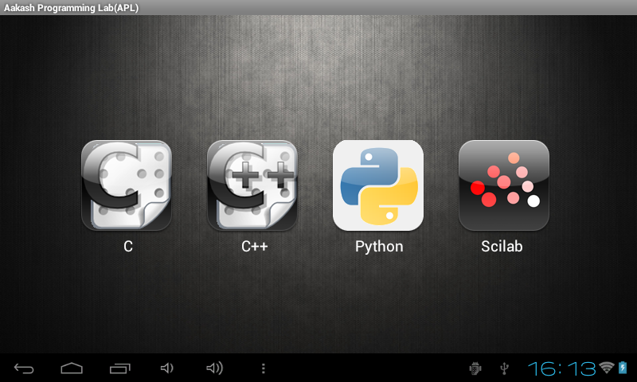

=================================
Using Aakash Programming Lab(APL)
=================================

Overview
========

1. Locate and click on Aakash Programming Lab(APL) icon in
   application menu

.. figure:: ../icons/apl.png
   :align: center
   :alt: apl icon
   :width: 50px 
   :height: 50px

   `Aakash Programming Lab Icon`
   
2. After clicking on APL icon, you will see a screen with four icons
   horizontally placed, naming **C, C++, Python and Scilab**

   `APL main page`
	   
3. In any of the above four option(C, C++, Python, Scilab) we have
   following common components.

    - *Text editor*: is located on the left hand side. One can write
      source code in text editor. If you click on the text editor
      area, a virtual keyboard will appear and one can use it to write
      programs. Click ``back button`` (located at bottom left corner on
      Android status bar) to close the virtual keyboard.

      .. figure:: ../com_images/text_area_console_output.png
	 :align: center
	 :alt: text area and output console
	 :width: 400px 
	 :height: 240px

	 `Text editor with console output`
      
    - *Console output*: is located at right hand side, this will show
      the output of the program.

      .. figure:: ../com_images/back_button.png
	 :align: center
	 :alt: back button
	 :width: 50px
	 :height: 35px

	 `Back button`

    - *Execute button*: is located on left side of text area. It is a
      small icon(looks like gears). After writing code in text editor,
      one can click on ``execute`` button to view output. The output
      will appear in console output screen(it should take
      approximately 2 to 10 seconds, depends upon code and algorithm).

      .. figure:: ../com_images/execute.png
	 :align: center
	 :alt: execute
	 :width: 50px
	 :height: 50px

	 `Execute button`
    
    - *Example Programs*: Clicking on the ``option button`` at bottom
      (looks like three vertical dots), will pop up the horizontal
      menubar from the bottom. One of the option is ``Example`` menu.
      
      .. figure:: ../com_images/option_button.png
	 :align: center
	 :alt: option button
	 :width: 50px 
	 :height: 35px
	    
	 `Option button`

      .. figure:: ../com_images/horizontal_menubar.png
	 :align: center
	 :alt: horizontal menubar
	 :width: 500px 
	 :height: 45px	
		 
	 `Menu bar with options`
    
    - *Save Code*: The ``Save Code`` option will pop up a dialog box
      which ask's for a file name. You don't have to provide the file
      extension, it will be appended by-default. All codes will be
      saved in ``/mnt/sdcard/APL/`` directory. Within the ``/APL/``
      directory, you can browse through respective language directory
      to view your code or an [image]_ file.

      .. figure:: ../com_images/cpp_name_code.png
	 :align: center
	 :alt: horizontal menubar
	 :width: 400px 
	 
	 `Saving the code`	 

    - Click on the ``Example`` Programs button, it will show list of
      example programs. Click on any example to select. The example
      code will appear on text editor. Then click on the execute
      button to run. Output will appear in Console output. One can
      optionally edit the code in text editor and execute it again.

      .. figure:: ../com_images/choose_ur_file.png
	 :align: center
	 :alt: choose examples(python)
	 :width: 280px 
	 :height: 150px	

	 `List of examples`

4. Scilab has one extra component, i.e *plot* option. It is located at
   top left corner of the page. Check this option if your code has any
   plots involved. Uncheck when not needed. Most examples provided in
   Scilab have graphical output.

   .. figure:: ../com_images/plot_icon.png
      :align: center
      :alt: plot icon check box for scilab graphical output

      `Plot - check box`

5. One can switch back to other programming environment by clicking
   ``back button`` which will land you to ``Main page`` (step 2).

6. To exit ``APL`` one has to click ``back button`` twice, this will pop
   up one confirmation dialog box. Click ``Yes`` to exit `Aakash
   Programming Lab`

   .. figure:: ../com_images/exit.png
      :align: center
      :alt: exit APL
      :width: 400px 
      :height: 250px	
	       
      `exit Aakash programming lab`

